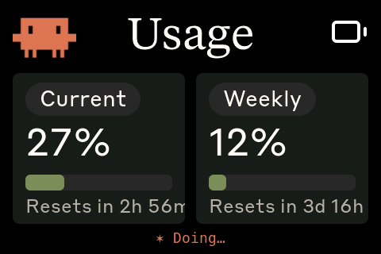

# Cmeter3.5 — ESP32-S3-Touch-LCD-3.5

> **A fork of [Clawdmeter](https://github.com/HermannBjorgvin/Clawdmeter) by
> [@hermannbjorgvin](https://github.com/HermannBjorgvin).** Hardware:
> [Waveshare ESP32-S3-Touch-LCD-3.5](https://www.waveshare.com/esp32-s3-touch-lcd-3.5.htm)
> ([wiki](https://www.waveshare.com/wiki/ESP32-S3-Touch-LCD-3.5) ·
> [schematic](https://files.waveshare.com/wiki/ESP32-S3-Touch-LCD-3.5/ESP32-S3-Touch-LCD-3.5-Schematic.pdf)).

A desk-side **Claude Code usage monitor and event notifier**.

A small ESP32-S3 touchscreen sits on your desk and shows your live Anthropic
usage (5-hour and weekly rate-limit utilization + reset countdowns), and
**reacts to your Claude Code sessions in real time** — a coloured banner and a
Warcraft-peasant voice line when a session starts, when you send a prompt, when
Claude finishes, on errors, and when Claude needs your permission.

> This is a hardware fork of the upstream Clawdmeter, re-targeted to the
> **Waveshare ESP32-S3-Touch-LCD-3.5 (non-"B")** and re-architected to feed the
> device over **USB serial** (no Bluetooth), because it runs from **WSL2**.



*The 480×320 landscape Usage dashboard (live capture): current 5-hour and weekly
rate-limit utilization with reset countdowns. Tap the screen to toggle the
pixel-art Clawd splash.*

---

## 1. Hardware

| Component | Part | Bus / Pins |
|---|---|---|
| Display | **ST7796** 320×480 IPS, run **480×320 landscape** | SPI: DC=3, CS=-1, SCK=5, MOSI=1, MISO=2; BL=6 (active-high) |
| Touch | **FocalTech FT6336** capacitive | I²C @ **0x38** (SensorLib `TouchDrvFT6X36`) |
| I/O expander | **TCA9554** | I²C @ 0x20 — ch.1 = LCD reset pulse |
| PMU | **AXP2101** | I²C @ 0x34 — LCD power rails + battery |
| Audio codec | **ES8311** + **NS4150B** amp + integrated speaker | I²C @ 0x18; I²S MCLK=12 BCLK=13 LRCK=15 DOUT=16 |
| IMU | **QMI8658** | I²C @ 0x6B (initialised, unused) |
| Shared I²C | — | **SDA=8, SCL=7** |
| Power/USB | USB-C (USB-JTAG/serial), `/dev/ttyACM0` | — |

**No Bluetooth and no physical buttons are used** — both were removed. The only
input is the touchscreen (tap toggles the splash animation ↔ the dashboard).

> **Identifying your board.** The genuine "3.5**B**" uses an AXS15231B QSPI panel
> with touch at 0x3B. This project is for the **non-B 3.5**: ST7796 over plain
> SPI, FocalTech touch at **0x38** (chip-ID reg 0xA8 = 0x11, 0xA3 = 0x64). If an
> I²C scan shows 0x38 and *no* 0x3B, you have this board.

---

## 2. Architecture

```
                WSL2 (Linux)                         ESP32-S3 device
  ┌───────────────────────────────────┐        ┌──────────────────────────┐
  │ Claude Code  ──hooks──▶ clawd-event.sh ─┐   │ main.cpp serial router   │
  │                                     │   ├──▶│  {"ev":..}  → sound+banner│
  │ claude-usage-serial.py ─────────────┘   │   │  {"s":..}   → dashboard   │
  │  (polls api.anthropic.com /v1/messages, │   │  "screenshot" → PNG dump  │
  │   reads rate-limit headers, 60s)        │   │                          │
  └───────────────────────────────────┘  USB   │ ST7796 LCD + FT6336 touch │
                                         serial │ ES8311 audio (warcraft)  │
                                                └──────────────────────────┘
```

- **Transport:** USB serial (`/dev/ttyACM0`), newline-delimited JSON. No BLE.
- **Usage:** `claude-usage-serial.py` POSTs a minimal request to
  `https://api.anthropic.com/v1/messages` and reads the
  `anthropic-ratelimit-unified-5h/7d-*` response headers, every 60 s. Token is
  read fresh from `~/.claude/.credentials.json` each poll (Claude Code keeps it
  refreshed) — nothing secret is stored on the device. Usage updates are
  **silent** (screen only).
- **Events:** Claude Code hooks → `clawd-event.sh <name>` → `{"ev":"<name>"}` on
  the serial port → firmware plays the matching **warcraft voice clip** (real
  game-sounds audio, embedded as PCM) + a coloured banner for ~2.2 s.

### Firmware layout (`firmware/src/`)

| File | Purpose |
|---|---|
| `main.cpp` | setup/loop, hardware init, serial-line router |
| `display_cfg.h` | pins, 480×320 landscape, extern objects |
| `ui.{h,cpp}` | splash + usage screens, event banner overlay |
| `splash.{h,cpp}` | 20×20 pixel-art creature, 16× upscale, centred 320×320 |
| `sound.{h,cpp}` | ES8311/I²S; per-event clip playback + boot beep |
| `sounds_warcraft.h` | **generated** embedded PCM (see §7) |
| `power.{h,cpp}` | AXP2101 rails + battery |
| `imu.{h,cpp}` | QMI8658 (unused output) |
| `usage_rate.*`, `data.h`, `icons.h`, `logo.h`, `font_*.c` | dashboard support |
| `lib/` | vendored GFX 1.5.5 (Waveshare ST7796, SPI-patched), TCA9554, es8311 |

---

## 3. Install / setup

### 3.1 Prerequisites

- **Windows + WSL2** (Ubuntu). The board's USB only reaches WSL2 via `usbipd`.
- `usbipd-win` on Windows (`winget install --exact dorssel.usbipd-win`, or the
  MSI from <https://github.com/dorssel/usbipd-win/releases>).
- `ffmpeg`, `python3` in WSL2 (for screenshots / regenerating sounds).
- PlatformIO. Not required system-wide — a venv lives at `./.piovenv`
  (`python3 -m venv .piovenv && .piovenv/bin/pip install platformio`).
- Claude Code logged in (so `~/.claude/.credentials.json` has an access token).

### 3.2 Attach the device to WSL2

In a **Windows Administrator PowerShell**:

```powershell
usbipd list                       # find the ESP32-S3 (VID 303a:1001), note BUSID
usbipd bind   --busid <BUSID>     # one-time (persists)
usbipd attach --wsl --busid <BUSID>   # re-run after every replug/reboot
```

Confirm in WSL2: `ls /dev/ttyACM0`.

### 3.3 Build & flash the firmware

```bash
./.piovenv/bin/pio run -d firmware
./.piovenv/bin/pio run -d firmware -t upload --upload-port /dev/ttyACM0
```

On boot you should hear a two-tone **self-test beep** and see the **Usage**
dashboard (dashes until the daemon feeds it).

### 3.4 Start the usage daemon (WSL2)

```bash
nohup python3 daemon/claude-usage-serial.py /dev/ttyACM0 >/tmp/claude-usage.log 2>&1 &
tail -f /tmp/claude-usage.log     # should log 'sent: {"s":..}' every ~60s
```

Stdlib-only (no pip deps). `PORT=/dev/ttyACM0 POLL=60` are overridable via env.

### 3.5 Enable Claude-session event notifications

Hooks live in `~/.claude/settings.json` (already added by this project, rtk
`PreToolUse` preserved; backup at `settings.json.bak`):

| Claude Code hook | Event | Device reaction |
|---|---|---|
| `SessionStart` | session-start | "Ready to work!" — green banner |
| `UserPromptSubmit` | task-acknowledge | "Work work." — blue banner |
| `Stop` | task-complete | "Job's done!" — green banner |
| `PostToolUseFailure` | error | "That was a mistake." — red banner |
| `Notification` | permission | "What now?" — amber banner |

These mirror the **game-sounds** plugin's 5 categories, so the host plays the
pack while the device shows a banner + plays the same-event voice. **Restart
Claude Code** for hook changes to take effect (hooks load at session start). New
sessions pick them up automatically. `tail -f /tmp/clawd-events.log` shows hooks
firing.

---

## 4. Daily use

1. (After reboot/replug) `usbipd attach --wsl --busid <BUSID>` in Windows admin PS.
2. `nohup python3 daemon/claude-usage-serial.py /dev/ttyACM0 >/tmp/claude-usage.log 2>&1 &`
3. Use Claude Code normally — the dashboard tracks usage; banners + voices fire
   on session events.

Tap the screen to toggle the **splash creature** ↔ the **usage dashboard**.

---

## 5. Sounds

- **Event sounds** are the *real* game-sounds **warcraft** clips (peasant voice
  lines), decoded from the plugin's MP3s, loudness-normalised, and embedded in
  flash as PCM. One iconic clip per event (the plugin rotates several; the device
  uses a fixed one to stay self-contained).
- **Boot beep**: synth two-tone, an audio self-test (if you hear it, the speaker
  path works).
- **Usage refresh**: silent by design. (It used to chime every 60 s — that was
  the "random beeps even when idle"; removed.) A one-shot alert tone plays only
  if your rate-limit status transitions OK → not-OK.
- **Volume**: `#define SND_VOLUME 60` in `firmware/src/sound.cpp` (0–100). Clip
  loudness target is set in the ffmpeg `loudnorm` step (§7).

---

## 6. Troubleshooting

| Symptom | Cause / fix |
|---|---|
| No `/dev/ttyACM0` | usbipd detached — re-run `usbipd attach --wsl --busid <BUSID>` (Windows admin PS). Survives replug only after `bind`. |
| Dashboard shows dashes | Daemon not running / token missing. Check `/tmp/claude-usage.log`; ensure Claude Code is logged in. |
| No event banners/sounds | Hooks need a Claude Code **restart**. Check `/tmp/clawd-events.log`: `skip (no device)` = port detached; `sent` = delivered. |
| Black screen | Wrong board profile. This is **ST7796 SPI** — confirm I²C 0x38 (FT6336), not 0x3B. The `screenshot` cmd dumps the framebuffer and will look fine even if the panel is dark — not a panel test. |
| AXP2101 init failed (serial) | Intermittent flaky shared-I²C; only affects battery %/charging. Power-cycle usually clears it. |
| Sounds inaudible but beep works | Clip level too low — re-run §7 with a higher `loudnorm` target, or raise `SND_VOLUME`. |
| `screenshot.sh` won't run | CRLF line endings (Windows/OneDrive). `sed -i 's/\r$//' screenshot.sh && chmod +x screenshot.sh`. |
| Build can't find `pio` | Use `./.piovenv/bin/pio` (not on PATH). |

---

## 7. Regenerating the embedded sounds (e.g., switch game-sounds pack)

The device pack is baked into `firmware/src/sounds_warcraft.h`. To rebuild it
from a different game-sounds pack:

```bash
PACK=warcraft   # any pack dir under the game-sounds plugin's sounds/
SRC=~/.claude/plugins/cache/citedy/game-sounds/3.0.0/sounds/$PACK
mkdir -p /tmp/wc
# pick one clip per event (paths vary per pack), then for each:
ffmpeg -nostdin -y -i "$SRC/<event>/<clip>.mp3" \
  -af "loudnorm=I=-12:TP=-1.0,alimiter=limit=0.97" \
  -ac 1 -ar 22050 -t 2.0 -f s16le /tmp/wc/<event>.pcm
# then emit C arrays into firmware/src/sounds_warcraft.h
# (snd_session_start / _task_acknowledge / _task_complete / _error / _permission,
#  each with a matching <name>_len), and rebuild.
```

`SND_RATE` in `sound.cpp` (22050) **must** equal the `-ar` rate, or playback is
pitch-shifted.

---

## 8. Credits

- Upstream Clawdmeter concept & firmware: **@hermannbjorgvin**.
- Clawd pixel-art animation: **@amaanbuilds**.
- Event sound effects: the **game-sounds** Claude Code plugin (citedy) — warcraft pack.
- This ESP32-S3-Touch-LCD-3.5 port + USB-serial/sound/event work: Jean-Roch Bécart.
