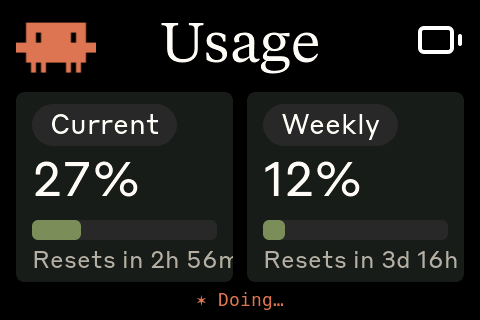
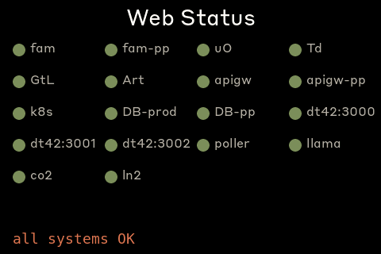
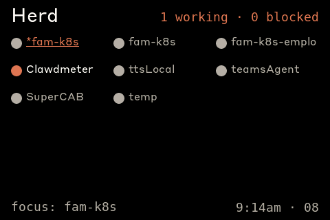

# Cmeter3.5 — ESP32-S3-Touch-LCD-3.5

> **A fork of [Clawdmeter](https://github.com/HermannBjorgvin/Clawdmeter) by
> [@hermannbjorgvin](https://github.com/HermannBjorgvin).** Hardware:
> [Waveshare ESP32-S3-Touch-LCD-3.5](https://www.waveshare.com/esp32-s3-touch-lcd-3.5.htm)
> ([wiki](https://www.waveshare.com/wiki/ESP32-S3-Touch-LCD-3.5) ·
> [schematic](https://files.waveshare.com/wiki/ESP32-S3-Touch-LCD-3.5/ESP32-S3-Touch-LCD-3.5-Schematic.pdf)).

A desk-side **Claude Code usage monitor and event notifier**.

A small ESP32-S3 touchscreen sits on your desk and shows your live Anthropic
usage (5-hour and weekly rate-limit utilization + reset countdowns), and
**reacts to your Claude Code sessions in real time** — a coloured banner and a
Warcraft-peasant voice line when a session starts, when you send a prompt, when
Claude finishes, on errors, and when Claude needs your permission.

> This is a hardware fork of the upstream Clawdmeter, re-targeted to the
> **Waveshare ESP32-S3-Touch-LCD-3.5 (non-"B")** and re-architected to feed the
> device over **USB serial** (no Bluetooth), because it runs from **WSL2**.



*The 480×320 landscape Usage dashboard (live capture): current 5-hour and weekly
rate-limit utilization with reset countdowns. Tap the screen to toggle the
pixel-art Clawd splash.*

---

## 1. Hardware

| Component | Part | Bus / Pins |
|---|---|---|
| Display | **ST7796** 320×480 IPS, run **480×320 landscape** | SPI: DC=3, CS=-1, SCK=5, MOSI=1, MISO=2; BL=6 (active-high) |
| Touch | **FocalTech FT6336** capacitive | I²C @ **0x38** (SensorLib `TouchDrvFT6X36`) |
| I/O expander | **TCA9554** | I²C @ 0x20 — ch.1 = LCD reset pulse |
| PMU | **AXP2101** | I²C @ 0x34 — LCD power rails + battery |
| Audio codec | **ES8311** + **NS4150B** amp + integrated speaker | I²C @ 0x18; I²S MCLK=12 BCLK=13 LRCK=15 DOUT=16 |
| IMU | **QMI8658** | I²C @ 0x6B (initialised, unused) |
| Shared I²C | — | **SDA=8, SCL=7** |
| Power/USB | USB-C (USB-JTAG/serial), `/dev/ttyACM0` | — |

**No Bluetooth and no physical buttons are used** — both were removed. The only
input is the touchscreen (tap toggles the splash animation ↔ the dashboard).

> **Identifying your board.** The genuine "3.5**B**" uses an AXS15231B QSPI panel
> with touch at 0x3B. This project is for the **non-B 3.5**: ST7796 over plain
> SPI, FocalTech touch at **0x38** (chip-ID reg 0xA8 = 0x11, 0xA3 = 0x64). If an
> I²C scan shows 0x38 and *no* 0x3B, you have this board.

---

## 2. Architecture

```
                WSL2 (Linux)                         ESP32-S3 device
  ┌───────────────────────────────────┐        ┌──────────────────────────┐
  │ Claude Code  ──hooks──▶ clawd-event.sh ─┐   │ main.cpp serial router   │
  │                                     │   ├──▶│  {"ev":..}  → sound+banner│
  │ claude-usage-serial.py ─────────────┘   │   │  {"s":..}   → dashboard   │
  │  (polls api.anthropic.com /v1/messages, │   │  "screenshot" → PNG dump  │
  │   reads rate-limit headers, 60s)        │   │                          │
  └───────────────────────────────────┘  USB   │ ST7796 LCD + FT6336 touch │
                                         serial │ ES8311 audio (warcraft)  │
                                                └──────────────────────────┘
```

- **Transport:** USB serial (`/dev/ttyACM0`), newline-delimited JSON. No BLE.
- **Usage:** `claude-usage-serial.py` POSTs a minimal request to
  `https://api.anthropic.com/v1/messages` and reads the
  `anthropic-ratelimit-unified-5h/7d-*` response headers, every 60 s. Token is
  read fresh from `~/.claude/.credentials.json` each poll (Claude Code keeps it
  refreshed) — nothing secret is stored on the device. Usage updates are
  **silent** (screen only).
- **Events:** Claude Code hooks → `clawd-event.sh <name>` → `{"ev":"<name>"}` on
  the serial port → firmware plays the matching **warcraft voice clip** (real
  game-sounds audio, embedded as PCM) + a coloured banner for ~2.2 s.

### Firmware layout (`firmware/src/`)

| File | Purpose |
|---|---|
| `main.cpp` | setup/loop, hardware init, serial-line router |
| `display_cfg.h` | pins, 480×320 landscape, extern objects |
| `ui.{h,cpp}` | splash + usage screens, event banner overlay |
| `splash.{h,cpp}` | 20×20 pixel-art creature, 16× upscale, centred 320×320 |
| `sound.{h,cpp}` | ES8311/I²S; per-event clip playback + boot beep |
| `sounds_warcraft.h` | **generated** embedded PCM (see §7) |
| `power.{h,cpp}` | AXP2101 rails + battery |
| `imu.{h,cpp}` | QMI8658 (unused output) |
| `usage_rate.*`, `data.h`, `icons.h`, `logo.h`, `font_*.c` | dashboard support |
| `lib/` | vendored GFX 1.5.5 (Waveshare ST7796, SPI-patched), TCA9554, es8311 |

---

## 3. Install / setup

### 3.1 Prerequisites

- **Windows + WSL2** (Ubuntu). The board's USB only reaches WSL2 via `usbipd`.
- `usbipd-win` on Windows (`winget install --exact dorssel.usbipd-win`, or the
  MSI from <https://github.com/dorssel/usbipd-win/releases>).
- `ffmpeg`, `python3` in WSL2 (for screenshots / regenerating sounds).
- PlatformIO. Not required system-wide — a venv lives at `./.piovenv`
  (`python3 -m venv .piovenv && .piovenv/bin/pip install platformio`).
- Claude Code logged in (so `~/.claude/.credentials.json` has an access token).

### 3.2 Attach the device to WSL2

In a **Windows Administrator PowerShell**:

```powershell
usbipd list                                   # find the ESP32-S3 (VID 303a:1001), note BUSID
usbipd bind   --busid <BUSID>                 # one-time (persists)
usbipd attach --wsl <Distro> --busid <BUSID>  # re-run after every replug/reboot
```

`<Distro>` is your WSL distribution (e.g. `Ubuntu-24.04`). Confirm in WSL2:
`ls /dev/ttyACM0`.

**Recommended — auto-attach (no more manual re-attach).** The ESP32-S3 USB-JTAG
re-enumerates on every flash and every reboot, so the manual `attach` above is
the #1 reason "the device stops updating". Copy the bundled script to a
Windows-side path (the `\\wsl.localhost\...` UNC isn't visible to an elevated
shell running as a different account) and run it **once** in an Administrator
PowerShell:

```bash
# In WSL: stage the script where Windows can read it.
cp ./usbipd-autoattach.ps1 /mnt/c/Users/<you>/
```

```powershell
# In Windows Admin PS:
cd C:\Users\<you>
powershell -ExecutionPolicy Bypass -File .\usbipd-autoattach.ps1 `
    -RunAsUser "<domain-or-host>\<your-user>" `
    -Distribution Ubuntu-24.04
```

- `-RunAsUser` is **required** on corporate / domain machines where UAC elevates
  to a *different* account (e.g. `…\Administrator`). WSL2 distros are per-user,
  so the Scheduled Task must run as the account that owns the distro, not the
  admin account that registered it. On a personal machine where you're already
  a local admin you can omit it.
- `-Distribution` defaults to `Ubuntu-24.04`. Pass the name `wsl -l -q` shows.
- `-HardwareId 303a:1001` is the default for the Cmeter3.5 board; override for
  other board revisions.
- `.\usbipd-autoattach.ps1 -Remove` tears the Scheduled Task down.

What the script does, once:

1. `usbipd bind --busid <id>` — persists the share for VID 303a:1001.
2. Registers Scheduled Task `usbipd-esp32`, runs **at logon as `-RunAsUser`**,
   action = a PowerShell loop that wakes WSL (`wsl -d <Distro> -- true`) and
   then runs `usbipd attach --wsl <Distro> --hardware-id 303a:1001 --auto-attach`
   (which itself blocks and re-attaches forever).

After this: replug → auto-reattaches; reflash → same (USB-JTAG re-enumerates);
reboot/logon → the task restarts the watcher. You never touch `usbipd attach`
by hand again.

### 3.3 Build & flash the firmware

```bash
./.piovenv/bin/pio run -d firmware
./.piovenv/bin/pio run -d firmware -t upload --upload-port /dev/ttyACM0
```

On boot you should hear a two-tone **self-test beep** and see the **Usage**
dashboard (dashes until the daemon feeds it).

### 3.4 Start the usage daemon (WSL2)

Quick / one-off:

```bash
nohup python3 daemon/claude-usage-serial.py /dev/ttyACM0 >/tmp/claude-usage.log 2>&1 &
tail -f /tmp/claude-usage.log     # should log 'sent: {"s":..}' every ~60s
```

**Recommended — systemd user service (survives reboot).** The `nohup` daemon
dies on WSL shutdown and won't restart itself; if usage freezes while event
banners still fire, this daemon is the thing that died. Install it once
(WSL2 here has `systemd=true`):

```bash
mkdir -p ~/.config/systemd/user
sed "s#__REPO__#$(pwd)#g" daemon/clawd-usage.service \
    > ~/.config/systemd/user/clawd-usage.service
systemctl --user daemon-reload
systemctl --user enable --now clawd-usage.service
loginctl enable-linger "$USER"     # start at WSL boot w/o an open terminal
```

Manage it:

```bash
systemctl --user status clawd-usage.service
journalctl --user -u clawd-usage.service -f      # or tail /tmp/claude-usage.log
systemctl --user restart clawd-usage.service
```

Run **either** the `nohup` form **or** the service, not both (two pollers
double-write the port — the service is the keeper). `Restart=always` brings it
back if it crashes; it rides out `/dev/ttyACM0` coming and going with usbipd.

Stdlib-only (no pip deps). `PORT=/dev/ttyACM0 POLL=60` are overridable via env.

### 3.5 Enable Claude-session event notifications

Hooks live in `~/.claude/settings.json` (already added by this project, rtk
`PreToolUse` preserved; backup at `settings.json.bak`):

| Claude Code hook | Event | Device reaction |
|---|---|---|
| `SessionStart` | session-start | "Ready to work!" — green banner |
| `UserPromptSubmit` | task-acknowledge | "Work work." — blue banner |
| `Stop` | task-complete | "Job's done!" — green banner |
| `PostToolUseFailure` | error | "That was a mistake." — red banner |
| `Notification` | permission | "What now?" — amber banner |

These mirror the **game-sounds** plugin's 5 categories, so the host plays the
pack while the device shows a banner + plays the same-event voice. **Restart
Claude Code** for hook changes to take effect (hooks load at session start). New
sessions pick them up automatically. `tail -f /tmp/clawd-events.log` shows hooks
firing.

---

## 4. Daily use

1. Device attach: nothing to do if you ran `usbipd-autoattach.ps1` (§3.2);
   otherwise `usbipd attach --wsl <Distro> --busid <BUSID>` in a Windows admin
   PS after each reboot/replug.
2. Daemon: nothing to do if you installed the systemd user service (§3.4) —
   it auto-starts at boot. Otherwise `nohup python3
   daemon/claude-usage-serial.py /dev/ttyACM0 >/tmp/claude-usage.log 2>&1 &`
3. Use Claude Code normally — the dashboard tracks usage; banners + voices fire
   on session events.

Tap the screen to toggle the **splash creature** ↔ the **usage dashboard**.

---

## 5. Sounds

- **Event sounds** are the *real* game-sounds **warcraft** clips (peasant voice
  lines), decoded from the plugin's MP3s, loudness-normalised, and embedded in
  flash as PCM. One iconic clip per event (the plugin rotates several; the device
  uses a fixed one to stay self-contained).
- **Boot beep**: synth two-tone, an audio self-test (if you hear it, the speaker
  path works).
- **Usage refresh**: silent by design. (It used to chime every 60 s — that was
  the "random beeps even when idle"; removed.) A one-shot alert tone plays only
  if your rate-limit status transitions OK → not-OK.
- **Volume**: `#define SND_VOLUME 60` in `firmware/src/sound.cpp` (0–100). Clip
  loudness target is set in the ffmpeg `loudnorm` step (§7).

---

## 6. Troubleshooting

| Symptom | Cause / fix |
|---|---|
| No `/dev/ttyACM0` (usage stops updating) | usbipd detached (replug/reboot/flash re-enumerated the device). One-off fix: `usbipd attach --wsl <Distro> --busid <BUSID>` (Windows admin PS). Permanent fix: run `usbipd-autoattach.ps1` once (§3.2). Then restart the daemon (next row). |
| Daemon logs `PermissionError(13)` (or `FileNotFoundError`) every poll after a replug; usbipd shows the device `Shared` but not `Attached` | The logon task's `--auto-attach` watcher died, so the replug never reached WSL. The combined daemon self-heals this (detach→reattach on any serial-write `OSError`) within one poll — check its journal for `heal:` lines. If heal is off/failing: one-off `usbipd attach --wsl <Distro> --busid <BUSID>` (non-elevated user PS), and check `heal=on` + a valid `usbipd=` path in the daemon's startup log line. |
| Auto-attach Scheduled Task is `Running` but `/dev/ttyACM0` never appears | Task is executing under the wrong user account (typical on AD/corp machines where UAC elevates to a different admin account). WSL2 distros are per-user, so the task can't reach yours. Re-run `usbipd-autoattach.ps1 -RunAsUser "<domain>\<your-user>"` (§3.2). Verify with `(Get-ScheduledTask usbipd-esp32).Principal.UserId` — must match the account that owns the WSL distro. |
| After reboot/logon, task says `State: Running` but `LastRunTime` is stale (days old) and busid stays `Shared` | The AtLogOn trigger didn't fire — on AD machines the logon-event principal can be reported as SID / UPN / `DOMAIN\user` variants, and a trigger `-User` filter that string-matches one variant silently fails for the others. The bundled script now omits `-User` from the trigger; if you have an older registered task, re-run `usbipd-autoattach.ps1 -RunAsUser "<domain>\<your-user>"` to overwrite it. One-shot recovery (no re-register needed): `Stop-ScheduledTask usbipd-esp32; Start-ScheduledTask usbipd-esp32` in an Admin PS. |
| `usbipd attach: Unrecognized command or argument 'Ubuntu-24.04'` | usbipd-win ≥ 5.x changed syntax: distro is now `--wsl <Name>`, not `--wsl --distribution <Name>`. The bundled script uses the new form; if you're invoking manually, drop `--distribution`. |
| `wsl: There is no distribution with the supplied name` from an Admin PS | UAC put you in a different account than the one that installed WSL. Either run the script with `-RunAsUser` (above) or open the Admin PS as the same user (right-click PowerShell → Run as administrator; check with `whoami`). |
| Dashboard stale / shows dashes (but event banners still work) | Usage daemon died — event banners are hook-driven and independent, so they keep working while polling is dead. `systemctl --user restart clawd-usage.service` (or check `/tmp/claude-usage.log`); ensure Claude Code is logged in for the token. |
| No event banners/sounds | Hooks need a Claude Code **restart**. Check `/tmp/clawd-events.log`: `skip (no device)` = port detached; `sent` = delivered. |
| Black screen | Wrong board profile. This is **ST7796 SPI** — confirm I²C 0x38 (FT6336), not 0x3B. The `screenshot` cmd dumps the framebuffer and will look fine even if the panel is dark — not a panel test. |
| AXP2101 init failed (serial) | Intermittent flaky shared-I²C; only affects battery %/charging. Power-cycle usually clears it. |
| Sounds inaudible but beep works | Clip level too low — re-run §7 with a higher `loudnorm` target, or raise `SND_VOLUME`. |
| `screenshot.sh` won't run | CRLF line endings (Windows/OneDrive). `sed -i 's/\r$//' screenshot.sh && chmod +x screenshot.sh`. |
| Build can't find `pio` | Use `./.piovenv/bin/pio` (not on PATH). |

---

## 7. Regenerating the embedded sounds (e.g., switch game-sounds pack)

The device pack is baked into `firmware/src/sounds_warcraft.h`. To rebuild it
from a different game-sounds pack:

```bash
PACK=warcraft   # any pack dir under the game-sounds plugin's sounds/
SRC=~/.claude/plugins/cache/citedy/game-sounds/3.0.0/sounds/$PACK
mkdir -p /tmp/wc
# pick one clip per event (paths vary per pack), then for each:
ffmpeg -nostdin -y -i "$SRC/<event>/<clip>.mp3" \
  -af "loudnorm=I=-12:TP=-1.0,alimiter=limit=0.97" \
  -ac 1 -ar 22050 -t 2.0 -f s16le /tmp/wc/<event>.pcm
# then emit C arrays into firmware/src/sounds_warcraft.h
# (snd_session_start / _task_acknowledge / _task_complete / _error / _permission,
#  each with a matching <name>_len), and rebuild.
```

`SND_RATE` in `sound.cpp` (22050) **must** equal the `-ar` rate, or playback is
pitch-shifted.

---

## 8. Web Status mode (dt42 status board)

A second screen that turns the device into a **services status board** — a grid
of green/red dots for websites, APIs, clusters, databases and machines — that
the device **auto-rotates with the usage screen** (every 30 s; tap to advance).



### 8.1 Architecture (end to end)

```
  targets.json  ──>  dt42 poller (statusboard.py)  ──>  status.json (HTTP :3004)
   (what to                checks each target               │        │
    monitor)                                                 │        └─> FAM web page
                                                             │            (/admin/statusboard,
                                                             │             pushed by the poller)
                                                             v
                              combined daemon (clawd-combined-serial.py)
                                 fetches usage + status.json, builds a
                                 FLAT line, writes it over USB serial
                                                             v
                                       ESP32 firmware ──> Web Status grid
```

- **`dt42/statusboard.py`** — a tiny dependency-free poller (runs on the host
  `deepthought42`). It reads `targets.json`, checks every target on an interval,
  serves `status.json` + a web dashboard on `:3004`, and *pushes* the snapshot to
  the FAM web app(s) so the board is viewable in-app.
- **`daemon/clawd-combined-serial.py`** — feeds BOTH Claude usage and the status
  board to the device over the one USB-serial link (so two daemons never fight
  over `/dev/ttyACM0`). Includes the same **usbipd self-heal** as the old usage
  daemon: any `OSError` on the serial write (port missing, `PermissionError`/
  EACCES, dead USB-over-IP link) triggers a cooldown-guarded
  `usbipd detach` → one-shot `attach` → wait-for-stable-port cycle, then one
  retry. Network errors never trigger it. `HEAL=0` disables; `USBIPD_EXE`,
  `USBIPD_WSL_DISTRO`, `USBIPD_HWID`, `HEAL_COOLDOWN` override. Startup log
  shows `heal=on usbipd=<path>`.
- **Firmware** — `SCREEN_STATUS` renders the dot grid; rotation + tap live in
  `ui.cpp` / `main.cpp`, gated by `CLAWD_STATUS_SCREEN` (see 8.4).

### 8.2 The serial protocol (and why it's flat)

The status line is a **flat** object — the item list is a delimited string, NOT
a JSON array:

```
{"sb":1,"g":"fam=1;fam-pp=1;DB-prod=0;dt42:3000=1;...","lf":"! last fail: DB-prod  2026-06-15 10:15","clk":"8:23am · 04"}
   sb : marker (1) so the firmware routes it to the status handler
   g  : "short=state;..."   state 1=ok 0=down 2=unknown
   lf : pre-formatted bottom "last fail" line; when all green it carries the
        last poller check time ("all systems OK @ 8:23am")
   clk: host-formatted corner clock, "time · day-of-month" (device has no RTC;
        also sent on usage payloads — either one refreshes both screens'
        bottom-right corner). Raw UTF-8 (ensure_ascii=False), 12h no leading 0.
```

On-device the status screen also shows a top-right **"N up · M down"** summary
counted from `g` — green when everything is up, red (with the title) the moment
anything is down.

The firmware splits `g` with `strtok` (plain C) and drives a **pre-created grid
of dot+label widgets** — it never allocates or parses a JSON array at runtime.
This is deliberate: an on-device **JSON array parse hung the firmware**; doing
the formatting in the daemon and sending flat scalars (the same shape as the
usage payload) is what made it reliable.

### 8.3 Configuring the target list (`targets.json`)

The list lives in **`~/statusboard/targets.json` on dt42** (a sanitized copy is
committed as **`dt42/targets.example.json`**). It is **re-read every poll cycle**
— edit it and the change shows up on the device, the web dashboard and the FAM
page within ~45 s, no restart.

Each entry: `name` (full), `short` (the grid label — keep ≤ ~9 chars or it gets
tight on the 4-column grid), and a check `type`:

| `type` | Checks | Fields |
|---|---|---|
| `https` / `http` | GET the URL | `url`; one of `ok_below` (up if code < N), `ok_codes` (up if code ∈ list), `expect_body` (up if body contains text); `insecure:true` skips TLS verify |
| `tcp` | open host:port | `host`, `port` |
| `systemd_user` | `systemctl --user is-active` | `unit` |

Top-level keys: `port` (web dashboard, 3004), `poll_interval`, `timeout`, and
`pushes` (list of `{url, token}` FAM ingest endpoints — **holds the secret
token, so the live file is git-ignored**; the example uses a placeholder).

### 8.4 Enabling / disabling on the device

`firmware/src/clawd_config.h`:

```c
#define CLAWD_STATUS_SCREEN 1   // 1 = Usage + Web Status (rotates); 0 = usage-only
```

Flip to `0` and re-flash for the original usage-only build (status lines ignored,
no rotation, tap toggles the splash as before).

### 8.5 Running it

```bash
# On the host with the device (combined usage + status):
cp daemon/clawd-combined-serial.service ~/.config/systemd/user/
systemctl --user disable --now clawd-usage.service statusboard-serial.service 2>/dev/null
systemctl --user daemon-reload && systemctl --user enable --now clawd-combined-serial.service

# On dt42 (the poller that owns targets.json + serves :3004 + pushes to FAM):
cp dt42/targets.example.json ~/statusboard/targets.json   # then set the real token
cp dt42/statusboard.py dt42/index.html ~/statusboard/
cp dt42/statusboard.service ~/.config/systemd/user/
systemctl --user daemon-reload && systemctl --user enable --now statusboard.service
```

Debug tip: `./screenshot.sh out.png` dumps the live framebuffer over serial —
the only reliable way to see the screen, since native USB-CDC does **not** flush
serial output before a firmware hang.

### 8.6 Failure history

The poller records each **failure episode** (down → recovery) per target in
`history.json`, kept for **60 days** (capped 50/item), and exposes them in
`status.json` under `history` plus a `fails` count per item. Both the dt42
dashboard and the in-FAM `/admin/statusboard` page show a clickable **clock
icon** on each tile (with a count badge) that opens a modal listing that item's
past failures — down time, recovery, and duration. The ESP32 screen is
unaffected (it shows live state only, not history).

---

## 9. Herd mode (herdr agent board)

A third rotating screen showing every **herdr** agent (the terminal workspace
manager for AI coding agents) as a dot grid — who's idle, who's working, and
above all **who's blocked waiting on you**.



### 9.1 How it works

```
  herdr server (unix socket ~/.config/herdr/herdr.sock)
     │  `herdr agent list` every 30s poll cycle          (fallback refresh)
     │  events.subscribe: pane.agent_status_changed etc.  (live push, ~2s)
     v
  combined daemon (clawd-combined-serial.py, herd_watcher thread)
     v  {"hr":1,"g":"*fam-k8s=1;Clawdmeter=2;...","sum":"1 working · 1 blocked",
         "fl":"focus: fam-k8s","clk":"8:23am · 04","show":1}
  ESP32 firmware ──> Herd grid (SCREEN_HERD)
```

- The daemon subscribes on herdr's unix socket to `pane.agent_status_changed`
  (per pane) + pane created/closed/detected/focused, so the grid updates live
  (~2 s debounce) instead of waiting for the 30 s poll (kept as fallback). The
  watcher reconnects on socket loss and re-subscribes when panes change.
  NB: herdr names status events dotted (`pane.agent_status_changed`) but
  topology events underscored (`pane_agent_detected`) — the daemon handles both.
- `g` states: `0`=idle (grey) `1`=working (amber) `2`=blocked (**red**)
  `3`=unknown. A `*` name prefix = the focused pane (accent orange +
  underlined on-device). Labels are cwd basenames, ≤13 chars (3-column grid).
- `"show":1` makes the firmware **switch to the Herd screen** and hold it a
  full rotation interval. The daemon sets it only for statuses in `HERD_SHOW`
  (default `blocked,done` — working/idle flap on every agent turn and would
  pin the screen). A *new* blocked agent additionally fires the existing
  `{"ev":"permission"}` banner + sound, edge-triggered.
- Env knobs: `HERD_SHOW` (statuses that force the screen), `HERD_DEBOUNCE`
  (min s between event pushes, default 2), `HERDR_EXE`, `HERDR_SOCK`.
- No herdr installed / not running → the payload is skipped and the screen
  simply drops out of the rotation (which now cycles Usage → Web Status →
  Herd across whichever screens have data).

### 9.2 Tap-to-focus (remote control)

**Tapping an agent cell focuses that pane on the desktop.** Each cell has a
transparent LVGL hit zone that sends `{"btn":<cell-index>}` up the serial
link (no bubbling, so a tap on empty space still advances the screen). The
daemon runs a `serial_reader` thread that maps the index back to the pane id
at that position in the last-sent grid and runs `herdr agent focus <pane>`.

Because the daemon now *reads* the port continuously, `screenshot.sh`
coordinates via a pause file (`/tmp/clawd-serial-reader.pause`): it touches
the file, waits ~1 s for the reader to release the port, captures, and
removes it. Anything else the firmware prints (`USAGE_OK`, boot logs) is
ignored by the reader. Focus is deliberately the **only** device-initiated
action — no blind "approve" buttons.

### 9.3 Remote screen (nav + shortcut prompts)

A fourth screen (reachable by **tap only** — auto-rotation skips it, since a
control surface carries no info) with:

- **`< Prev` / `Next >`** — focus the previous/next herdr pane (cycles the
  pane ring relative to the currently focused one); **`+ Tab`** — new focused
  tab. Immediate, single tap.
- **`+ CLI`** — spawn a new focused `claude --dangerously-skip-permissions`
  session, with a **project picker**: the first tap turns the four big
  buttons into a chooser for ~5 s — three project dirs (pinned `"projects"`
  from `shortcuts.json` first, then the most recently active
  `~/.claude/projects`, existence-verified via a filesystem-guided slug
  decode) plus **`New tmp/`**, which mkdirs an auto-named scratch dir
  (`tmp-MMDD-HHMM` under `CLAWD_TMP_BASE`, default `~/tmp`) and spawns there.
  Tapping `+ CLI` a second time means "here" (the focused pane's dir);
  timeout reverts to the shortcuts with nothing spawned.
- **Four shortcut buttons** that type a canned prompt into the **focused**
  pane and submit it (`herdr pane run`). These are **arm/confirm**: first tap
  arms (blue "Tap again: …" banner + accent border), second tap within 4 s
  sends (green "Sent: …" banner). Leaving the screen disarms.
- Prompts live in **`~/.config/clawd/shortcuts.json`** (seeded from
  `daemon/shortcuts.example.json` on first run; re-read every cycle, so edits
  apply without a restart). The daemon pushes the labels to the device
  (`{"rm":1,"b0":...}`) so the buttons always show what would be sent. The
  defaults were mined from real session history: **Wrap up** (save + notes +
  commit/push + handoff summary), **Commit+push**, **Progress?**, **Continue**.
- The bottom-left `focus:` line shows which pane the buttons act on.
- Debug: the serial line `{"scr":N}` switches to screen N (screen_t order:
  splash, usage, status, herd, remote) — how the host screenshots the
  tap-only Remote screen.

---

## 10. Credits

- Upstream Clawdmeter concept & firmware: **@hermannbjorgvin**.
- Clawd pixel-art animation: **@amaanbuilds**.
- Event sound effects: the **game-sounds** Claude Code plugin (citedy) — warcraft pack.
- This ESP32-S3-Touch-LCD-3.5 port + USB-serial/sound/event work: Jean-Roch Bécart.
